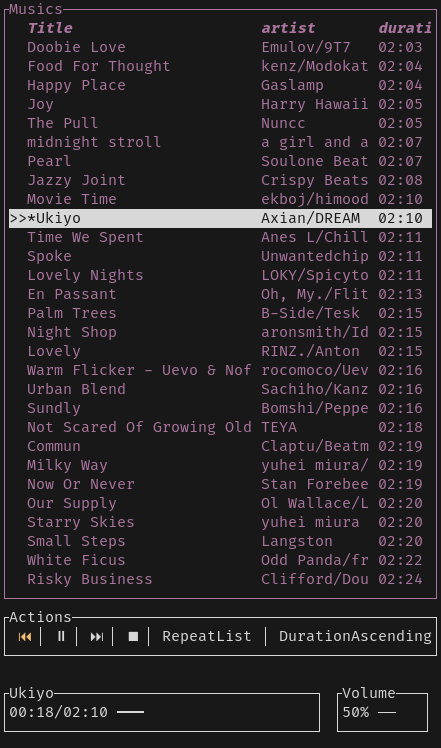
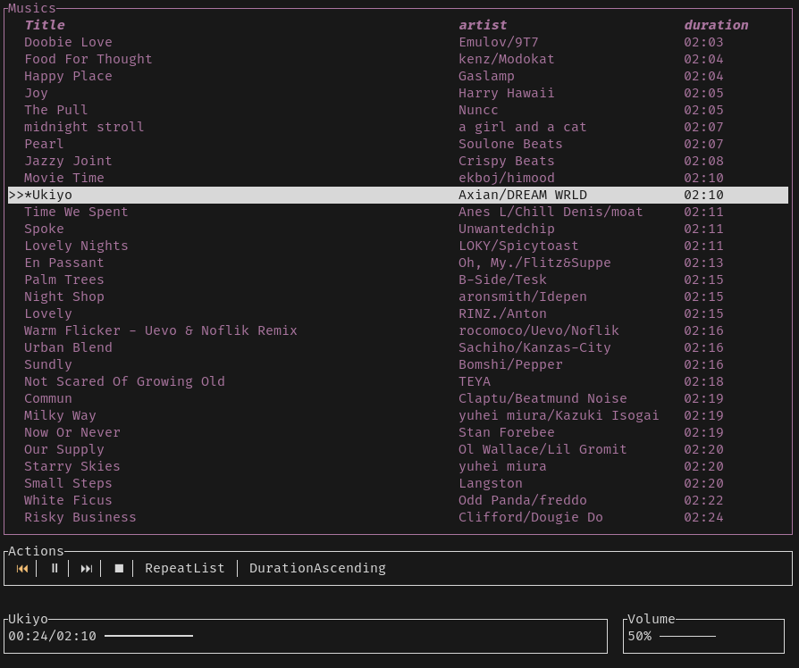
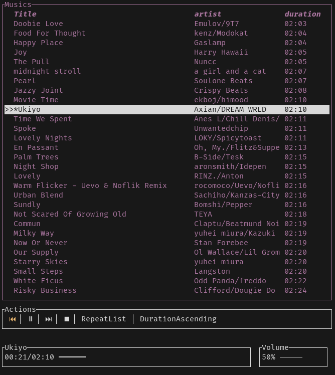
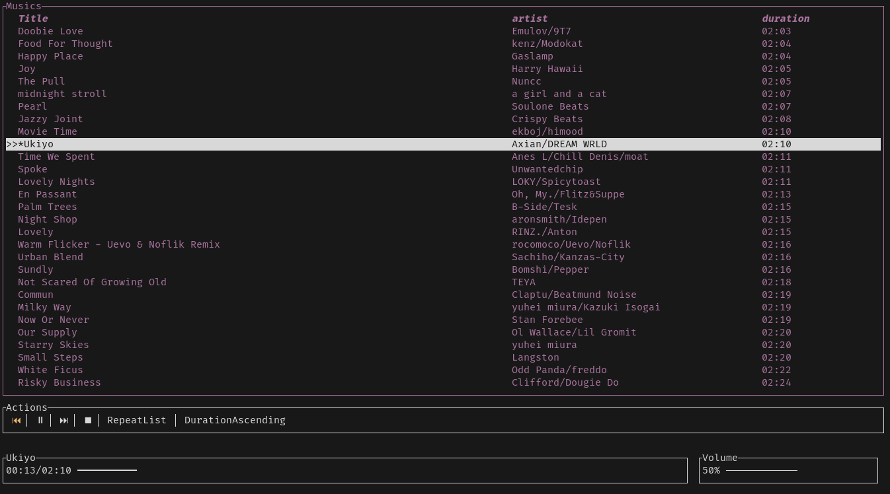

<h1 align="center">mplayer-client</h1>

A simle terminal based [DBus](https://www.freedesktop.org/wiki/Software/dbus/#whatisd-bus) client written in [Rust](https://www.rust-lang.org) for the _mplayer-server_

# Showcase
||||
|-------|-------|-------|
||||
___

# Thanks to:
- [Ratatui](https://github.com/ratatui-org/ratatui)
- [Rust Fuzzy Search](https://gitlab.com/EnricoCh/rust-fuzzy-search)
- [Loft-rs](https://github.com/Serial-ATA/lofty-rs)
- [Zbus](https://github.com/dbus2/zbus)
- [Serder](https://github.com/serde-rs/serde)
> and many others

# Usage
- Install this client
- Install the `mplayer-server`
- Modify config file to include your musics directory
- Make sure the `mplayer-server` is running
- Run the client with the path of the config as an argument, or it will try this path `$HOME/.config/mplayer-client/config.toml`
- Enjoy
> more detailed instructions soon

# Keybinds
|Region|Mode|Keybind|Desc|
|------|----|-----|------|
|List|Normal|`j`|Scroll down|
|List|Normal|`k`|Scroll up|
|List|Normal|`Space` or `Enter`|Play the music under selection|
|List|Normal|`s`|Scroll to the currently playing music|
|List|Normal|`gg`|Scroll to the start of the list|
|List|Normal|`G`|Scroll to the end of the list|
|List|Normal|`m`|Toggle mute|
|List|Normal|`p`|Toggle pause for the currently playing song|
|List|Normal|`<CTR>d`|Scroll half page down|
|List|Normal|`<CTR>u`|Sroll half page up|
|List|Normal|`/`|Enable `Search` mode|
|List|Normal|`Alt + j`|Select the `Actions` regin (move region down)|
|List|Normal|`Alt + k`|Select the `Seeker` regin (move region up)|
|List|Normal|`gg`|Go to the top of the list|
|List|Normal|`G`|Go to the bottom of the list|
|List|Search|`Character`|Register the character to the search querry|
|List|Search|`Esc`|Enable `After Search` mode|
|List|Search|`Enter`|Play the music under selection|
|List|After Search|`j`|Move down|
|List|After Search|`k`|Move up|
|List|After Search|`Space` or `Enter`|Play the music under selection|
|List|After Search|`m`|Toggle mute|
|List|After Search|`p`|Toggle pause for the currently playing song|
|Actions|Normal|`l`|Move right|
|Actions|Normal|`h`|Move left|
|Actions|Normal|`Space` or `Enter`|Toggle the playing mode from playing to pausing and vice versa|
|Actions|Normal|`m`|Toggle mute|
|Actions|Normal|`p`|Toggle pause for the currently playing song|
|Actions|Normal|`Alt + j`|Select the `Seeker` regin (move region down)|
|Actions|Normal|`Alt + k`|Select the `List` regin (move region up)|
|Seeker|Any|`m`|Toggle mute|
|Seeker|Any|`p`|Toggle pause for the currently playing song|
|Seeker|Any|`k`|Toggle play for the currently playing song if playing or the selected if not|
|Seeker|Playing|`l`|Seek to the next 5 seconds or play the next music if remaning duration less than 5|
|Seeker|Playing|`h`|Seek to the previous 5 seconds or play the previous music if remaning duration less than 5|
|Seeker|Pauseing|`l`|Seek to the next 5 seconds or play the next music if remaning duration less than 5|
|Seeker|Pauseing|`h`|Seek to the previous 5 seconds or play the previous music if remaning duration less than 5|
|Seeker|Stopping|`l`|Seek to the next 5 seconds or play the next music if remaning duration less than 5|
|Seeker|Stopping|`h`|Seek to the previous 5 seconds or play the previous music if remaning duration less than 5|
|Seeker|Playing|`k`|Toggle the playing mode from playing to pausing and vice versa|
|Volume|Normal|`Alt + j`|Select the `List` regin (move region down)|
|Volume|Normal|`Alt + k`|Select the `Action` regin (move region up)|
|Volume|Normal|`Alt + l` or `Alt + h`|Select the `Volume` regin|
|Volume|Normal|`l` or `k`|Increase volume|
|Volume|Normal|`h` or `j`|Decrease Volume|
|Volume|Any|`m`|Toggle mute|
|Volume|Normal|`Alt + j`|Select the `List` regin (move region down)|
|Volume|Normal|`Alt + k`|Select the `Action` regin (move region up)|
|Volume|Normal|`Alt + l` or `Alt + h`|Select the `Seeker` regin|

# Side Effects
- Can't play music with a non utf-8 encoded file names
