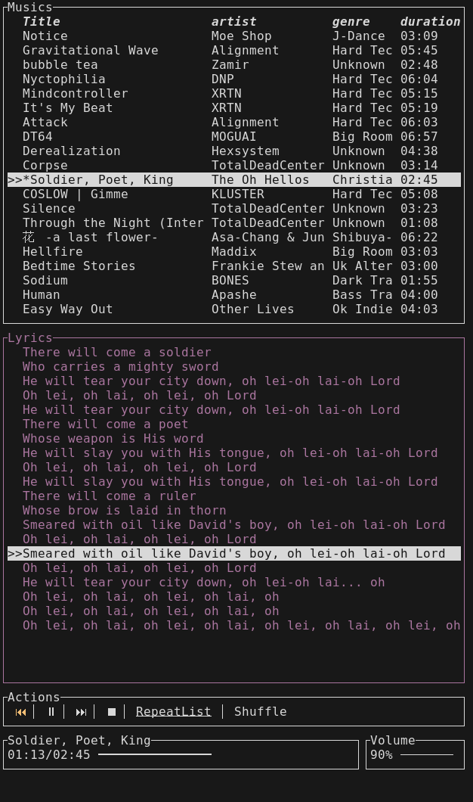
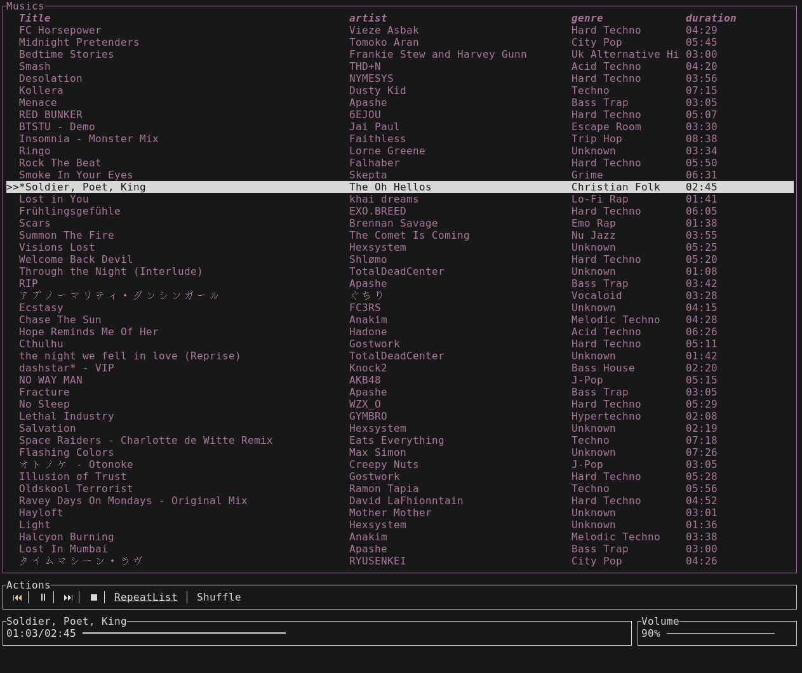
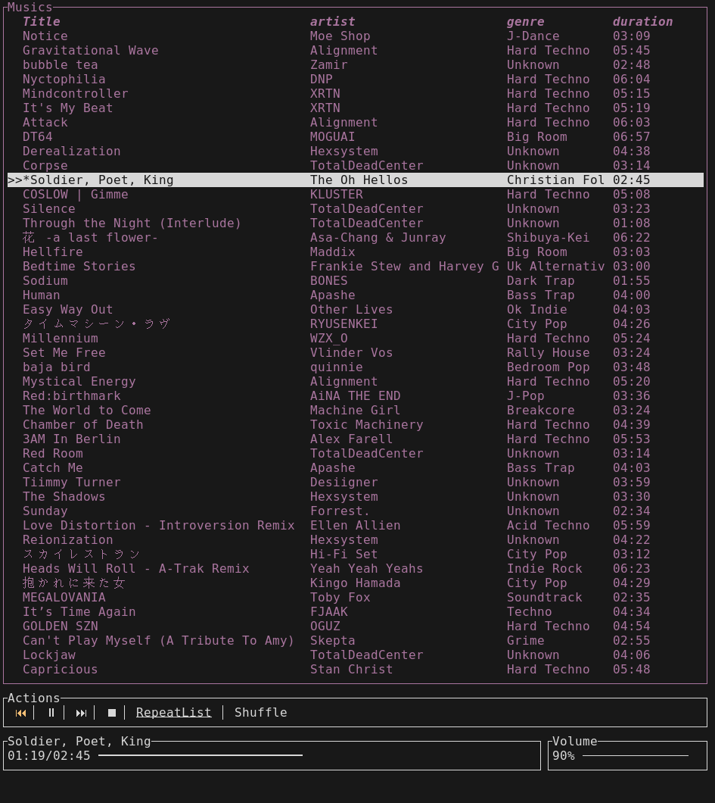
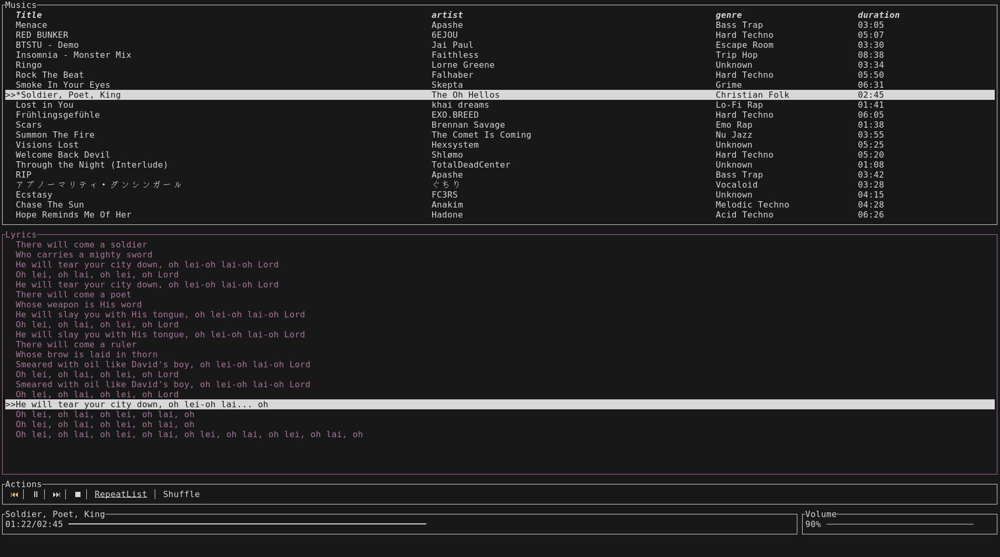

<h1 align="center">mplayer-client</h1>

Simple terminal based [DBus](https://www.freedesktop.org/wiki/Software/dbus/#whatisd-bus) client for the [_mplayer-server_](https://github.com/yassinebenarbia/mplayer-server) written in [Rust](https://www.rust-lang.org)

# Showcase
||||
|-------|-------|-------|
||||
___

# Thanks to:
- [Ratatui](https://github.com/ratatui-org/ratatui)
- [Rust Fuzzy Search](https://gitlab.com/EnricoCh/rust-fuzzy-search)
- [Loft-rs](https://github.com/Serial-ATA/lofty-rs)
- [Zbus](https://github.com/dbus2/zbus)
- [Serde](https://github.com/serde-rs/serde)
> and many others

# Usage
- Install the [mplayer-server](https://github.com/yassinebenarbia/mplayer-server).
- Run the `mplayer-server`.
- Install this client by cloning this repo and `cargo install --path ./mplayer-client`.
- Modify [config file](./config.example.toml) to your liking (optional) .
- Run the `mplayer-client`
>[!NOTE]
> you can provide the config file as the first argument to the client, or place it here `$HOME/.config/mplayer-client/config.toml`.
> more detailed instructions soon

# Keybinds and Configurations
[docs](./DOCS.md)
